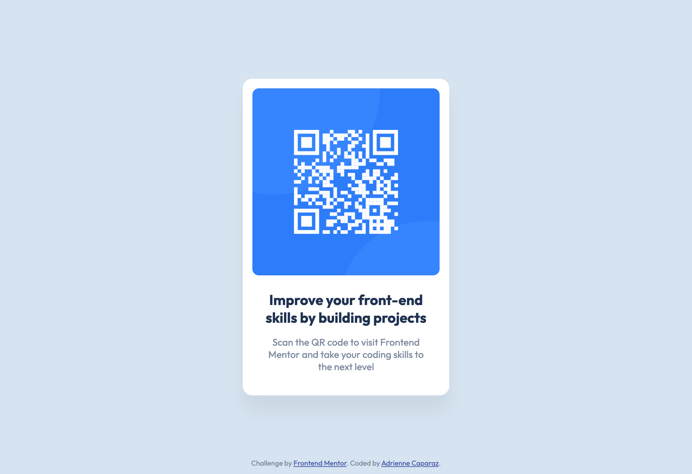

# Frontend Mentor - QR code component solution

This is a solution to the [QR code component challenge on Frontend Mentor](https://www.frontendmentor.io/challenges/qr-code-component-iux_sIO_H). Frontend Mentor challenges help you improve your coding skills by building realistic projects. 

## Table of contents

- [Overview](#overview)
  - [Screenshot](#screenshot)
  - [Links](#links)
- [My process](#my-process)
  - [Built with](#built-with)
  - [Useful resources](#useful-resources)
- [Author](#author)

## Overview

### Screenshot

### Links

- Solution URL: [https://www.frontendmentor.io/solutions/qr-code-component-using-css-flexbox-nXquRlX-2g](https://www.frontendmentor.io/solutions/qr-code-component-using-css-flexbox-nXquRlX-2g)
- Live Site URL: [https://adriennecaparaz.github.io/qr-code-component/](https://adriennecaparaz.github.io/qr-code-component/)

## My process

### Built with

- Semantic HTML5 markup
- CSS custom properties
- Flexbox

### Useful resources

- [FLEX: A simple visual cheatsheet for flexbox](https://flexbox.malven.co/) 
- [CSS fix for 100vh in mobile WebKit](https://css-tricks.com/css-fix-for-100vh-in-mobile-webkit/)

## Author

- Frontend Mentor - [@adriennecaparaz](https://www.frontendmentor.io/profile/adriennecaparaz)